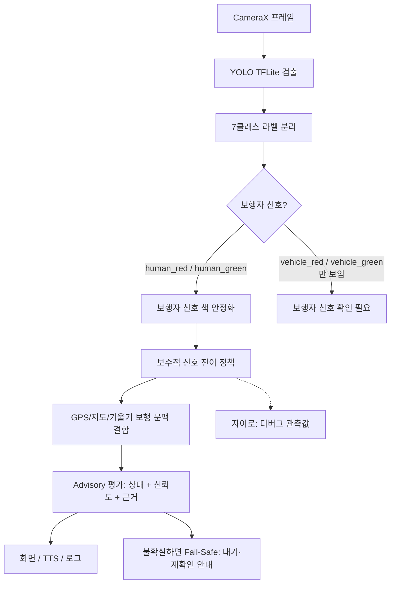

# 최종 발표/보고서용 판단 로직 정리 — 2026-05-05

## 1. 한 문장 설명
VIA는 카메라로 **보행자 신호등**을 우선 확인하고, GPS/횡단보도 매칭/기기 기울기는 현재 보행 문맥을 보조하며, 자이로는 디버그 관측값으로 기록해 사용자가 직접 판단할 수 있도록 **상황과 신뢰도**를 안내하는 보행 보조 앱이다.

## 2. 발표에서 강조할 안전 원칙
- 앱은 최종 판단자가 아니라 **보조 정보 제공자**다.
- `건너세요` 같은 명령형 문구를 쓰지 않고, `보행자 신호 초록으로 보임`처럼 관측 상황을 설명한다.
- 초록 신호 확인은 보수적으로 처리한다: 빨간 기준선, 단일 보행자 신호, 차량 신호 혼입 없음, 작은 신호/가림/재획득/cluster churn 없음이 필요하다.
- GPS, 기기 기울기, 지도 매칭은 초록을 새로 만들 수 없고, 짧은 시야 손실과 횡단보도 문맥 설명에만 사용한다. 자이로는 현재 디버그/관측 문맥에 남아 있지만 초록 확정 정책에는 직접 쓰지 않는다.

## 3. 전체 판단 플로우

## 4. 모델 입력과 7클래스 구조
현재 앱은 7클래스 모델을 우선 목록으로 사용한다.

| ID | 클래스 | 발표 설명 |
| --- | --- | --- |
| 0 | `bicycle` | 횡단보도 점유/주의 후보 |
| 1 | `motorcycle` | 횡단보도 점유/주의 후보 |
| 2 | `vehicle` | 차량류 병합, 점유/주의 후보 |
| 3 | `human_green` | 보행자 초록 신호, 신호 판단의 주 근거 |
| 4 | `human_red` | 보행자 빨간 신호, 신호 판단의 주 근거 |
| 5 | `vehicle_green` | 차량용 초록 신호, 보행자 신호로 쓰지 않음 |
| 6 | `vehicle_red` | 차량용 빨간 신호, 보행자 신호로 쓰지 않음 |

발표 포인트:
- 기존 단순 green/red보다 `human_*`과 `vehicle_*`를 분리해 차량 신호를 보행자 신호로 오판하는 위험을 낮춘다.
- 차량용 신호만 보이면 보행자 안내를 확정하지 않고 `보행자 신호 확인 필요` 계열로 안내한다.
- 320/416/448/512/640 모델은 속도와 정확도를 비교하기 위한 후보이며, 디버그 모델 선택에서 실제 파일명을 확인할 수 있다.

## 5. 상태별 사용자 안내 문구
| 내부 상태 | 화면 문구 | 음성 문구 | 의미 |
| --- | --- | --- | --- |
| `RED_CONFIRMED` | 보행자 신호 빨간색으로 보임 | 빨간불이 확인됩니다 | 보행자 빨간 신호가 안정적으로 보임 |
| `GREEN_CONFIRMED` | 보행자 신호 초록으로 보임 | 초록불이 확인됩니다 | 보행자 초록 신호가 보이고 보수적 게이트 통과 |
| `GREEN_WITH_CAUTION` | 초록으로 보이나 주의 필요 | 초록불이 확인되지만 차량 점유 가능성이 있습니다 | 초록 신호는 보이나 횡단보도 점유 위험 있음 |
| `TRANSITION_WAIT` | 다음 신호 대기 권장 | 다음 신호 전환을 기다립니다 | 현재 초록을 이 횡단보도 신호로 확정하기 어려워 다음 주기 대기 권장 |
| `UNCERTAIN_VIEW` | 신호 확인 불확실 | 신호 확인이 불안정합니다 | 시야/신뢰도/복수 신호/차량 신호 등으로 추가 확인 필요 |

## 6. 센서와 데이터 역할 분리
| 입력 | 역할 | 초록 확정 가능 여부 | 발표 설명 |
| --- | --- | --- | --- |
| Vision: `human_green`, `human_red` | 보행자 신호 색의 1차 근거 | 가능 | 실제 신호등 색을 직접 관측하므로 primary truth |
| Vision: `vehicle_green`, `vehicle_red` | 차량 신호 혼입 감지 | 불가능 | 보행자 안내를 억제하거나 신뢰도를 낮추는 근거 |
| GPS 현재 위치 | 현재 위치와 이동 문맥 | 불가능 | 가까운 횡단보도 거리/방향, 이동 여부 보조 |
| 횡단보도 매칭 cluster | 같은/새 횡단보도 문맥 확인 | 불가능 | cluster가 바뀌면 거리·시간 조건과 전이 종류로 same/new crossing을 구분 |
| 자이로 | 최근 움직임 관측값 | 불가능 | 현재 정책의 초록 확정/continuity tier에는 직접 사용하지 않고 디버그 문맥으로 확인 |
| 기기 기울기 | looking down/up 추정 | 불가능 | 휴대폰을 내려 시야가 잠깐 사라진 상황 보조 |
| 블루투스 버튼 | 기능 호출 입력 | 불가능 | 짧게: 주변 횡단보도 안내, 길게: 비상 연락 |

## 7. 보수적 신호 전이 정책
1. 기본 설정에서 앱은 시작 시 빨간 기준선을 먼저 요구한다. 시작하자마자 초록이 보이면 바로 확정하지 않고 `다음 신호 대기 권장`으로 안내한다.
2. 빨간 신호가 안정적으로 확인되면 `READY_FOR_GREEN_TRANSITION` 상태로 넘어간다.
3. 이후 초록 신호가 안정적으로 확인되면 내부적으로 걷기 가능 상태가 된다.
4. 하지만 사용자-facing 문구는 명령이 아니라 advisory로 변환된다.
5. 이동 후 cluster가 바뀌면 거리/시간 조건으로 `같은 횡단보도`인지 `새 횡단보도`인지 구분한다. 새 횡단보도로 판단되면 새 빨간 기준선을 다시 요구한다.
6. 걷는 중 `UNKNOWN`이 잠깐 나와도, 같은 횡단보도 매칭·GPS 이동·looking down 문맥이면 단계적으로 더 긴 grace window를 둔다.
7. grace가 끝났거나 새 횡단보도 가능성이 있으면 fail-safe로 대기/재확인 안내를 한다.

## 8. Fail-Safe 처리 예시
| 상황 | 앱 반응 | 이유 |
| --- | --- | --- |
| 차량 신호만 보임 | 보행자 신호를 화면 중앙에 맞추라고 안내 | 차량 신호는 보행자 신호 truth가 아님 |
| 신호등 여러 개가 보임 | 하나만 중앙에 맞추라고 안내 | 어떤 신호가 대상인지 불확실 |
| 신호가 작거나 가림 | 가까이 비추거나 확대 안내 | 오검출/색상 오판 가능성 증가 |
| 방금 신호를 다시 잡음 | 바로 초록 확정하지 않음 | 새 대상인지 기존 대상인지 불확실 |
| cluster가 최근 변경됨 | 신뢰도를 낮추고 불확실/대기 안내로 보수화 | 같은 횡단보도인지 새 횡단보도인지 거리·시간 조건으로 추가 판단 필요 |
| 초록 중 휴대폰을 내려 시야 상실 | 짧은 시간만 continuity 유지 | 실제 보행 중 시야 손실을 완충하되 장기 확정은 금지 |

## 9. 주변 횡단보도 안내 기능
- 현재 위치와 매칭된 횡단보도 좌표를 이용해 가까운 횡단보도까지의 거리와 방향을 안내한다.
- 예: `가까운 횡단보도는 약 25미터 전방 오른쪽 방향에 있습니다.`
- 위치 정확도가 낮거나 heading이 없으면 방향을 생략하고 거리만 안내한다.
- 이 기능은 **신호 색 판단과 분리**되어 있으며, 횡단보도의 위치/방향만 알려준다.

## 10. 블루투스 버튼 / 비상 연락
- Space 키로 입력되는 블루투스 리모컨을 지원한다.
- 짧게 누름: 주변 횡단보도 거리·방향 안내.
- 길게 누름: 비상 연락 화면을 열고 5초 유예 후 미리 작성된 문구를 SMS로 자동 발송.
- 별도 기능으로 문자 앱을 열어 사용자가 직접 내용을 추가할 수 있다.
- 버튼이 없는 사용자도 화면 버튼과 설정 화면으로 기능을 사용할 수 있다.

## 11. PPT에 넣기 좋은 자료 후보
### 흐름도
- `Camera -> 7cls Detection -> Pedestrian/Vehicle Signal Split -> Conservative Policy -> Advisory UI`
- `Vision primary / GPS-map-tilt support only` 역할 분리 그림
- `RED baseline -> GREEN transition -> UNKNOWN grace -> same/new crossing handoff` 상태 전이 그림

### 표
- 7클래스 라벨 표
- Advisory 상태별 화면/음성 문구 표
- 센서별 역할/책임 범위 표
- Fail-Safe 상황별 대응 표

### 스크린샷 후보
- 메인 화면: 상태 카드와 `보행자 신호 초록으로 보임`/`신호 확인 불확실` 상태
- 디버그 화면: 모델 파일명, FPS, advisory confidence/reasons 로그
- 영상 리플레이 화면: 샘플 영상 입력과 박스 표시
- 설정/사용 안내 화면: 보조 도구 고지와 상태 문구 설명
- 비상 연락 화면: 5초 자동 발송 유예 UI
- 주변 횡단보도 안내 실행 결과 Toast/TTS 상황

## 12. 발표 대본용 짧은 설명
> VIA는 카메라가 본 보행자 신호를 가장 중요한 근거로 사용합니다. GPS, 횡단보도 매칭, 기기 기울기는 보행 문맥을 보조할 뿐 초록 신호를 새로 만들지 않습니다. 자이로는 현재 디버그 관측값으로 남겨 움직임을 확인하는 데 사용합니다. 차량 신호가 보이거나 신호가 여러 개 보이면 초록으로 확정하지 않고 사용자가 화면을 다시 맞추도록 안내합니다. 그래서 앱은 `건너세요`라고 명령하지 않고 `보행자 신호 초록으로 보임`, `신호 확인 불확실`처럼 현재 관측 상태와 신뢰도를 설명합니다.

## 13. 교수님 피드백 대응 포인트
- “로직이 확실해야 한다” → primary truth와 support context를 분리했고, 초록 확정 게이트를 표로 설명 가능하다.
- “책임 문제가 있다” → 앱은 최종 판단자가 아니라 관측 상황 안내자이며, 명령형 문구를 제거했다.
- “차량 신호와 보행자 신호가 섞이면 위험하다” → 7클래스 모델에서 `human_*`과 `vehicle_*`를 분리하고 차량 신호는 보행자 truth로 쓰지 않는다.
- “실제로 검증 가능한가” → advisory state/confidence/reason 로그와 replay/field QA 체크리스트로 정량 평가할 수 있다.

## 14. 시연 모드 범위
이번 이슈에서는 시연 모드를 구현하지 않는다. 발표 시간이 부족하므로 PPT 자료와 실제 기능 설명 중심으로 정리하고, 시연 모드는 추후 필요할 때 별도 이슈로 검토한다.

## 15. 관련 코드/문서 참조
- `app/src/main/java/kr/co/gachon/pproject6/via/ml/DetectionLabels.kt` — 7클래스 라벨과 보행자/차량 신호 분리
- `app/src/main/java/kr/co/gachon/pproject6/via/ml/SignalAnalyzer.kt` — 검출 결과를 신호 분석 결과로 변환
- `app/src/main/java/kr/co/gachon/pproject6/via/ml/ConservativeWalkSignalPolicy.kt` — 보수적 red-baseline/green-transition 정책
- `app/src/main/java/kr/co/gachon/pproject6/via/ml/SignalAdvisoryEvaluator.kt` — advisory 상태/신뢰도/근거 산출
- `app/src/main/java/kr/co/gachon/pproject6/via/context/CrossingSupportManager.kt` — GPS/기울기/지도 문맥과 자이로 관측값
- `app/src/main/java/kr/co/gachon/pproject6/via/context/CrosswalkGuidanceMessageBuilder.kt` — 주변 횡단보도 거리·방향 문구
- `app/src/main/java/kr/co/gachon/pproject6/via/input/RemoteButtonPressClassifier.kt` — 블루투스 버튼 short/long press 분류
- `app/src/main/java/kr/co/gachon/pproject6/via/safety/EmergencyContactActivity.kt` — 비상 연락/자동 SMS 유예
- `resources/decisions/advisory-signal-policy-final-2026-05-05.md` — #26 최종 정책/평가 계획
